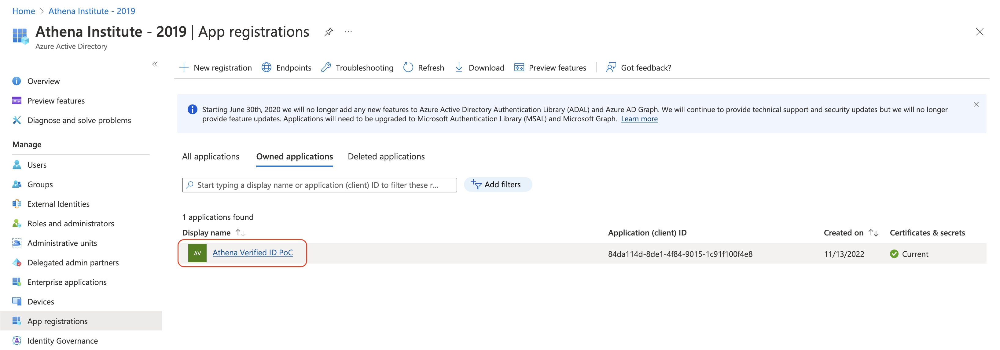
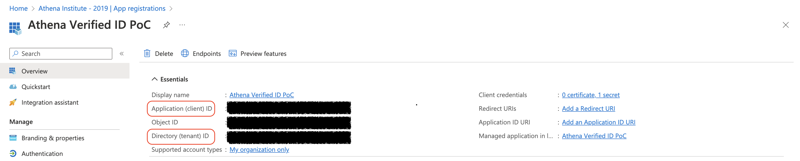
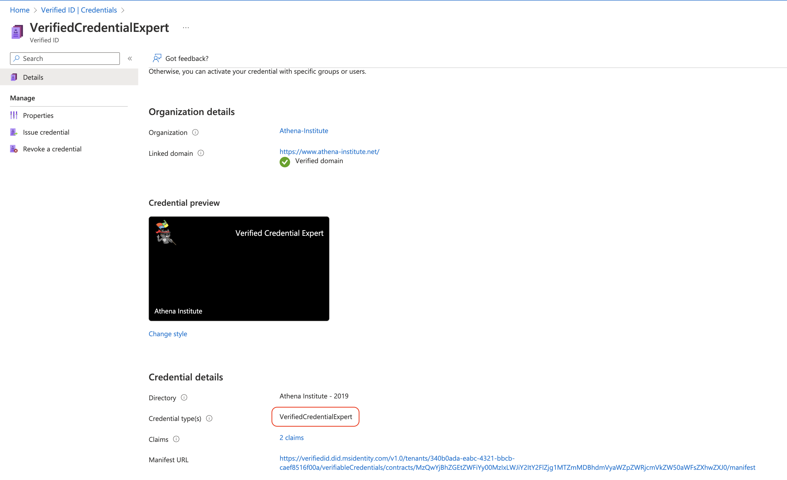

# Microsoft Entra Verified ID auth module

This module adds Microsoft Entra Verified ID as auth source to simpleSAMLphp.

## Disclaimer
This module was not created by Microsoft and will not be supported by them. Please use [github issues](https://github.com/windhamg/simplesamlphp-module-msverifiedid/issues/new) for any questions about this module.

## Credits
Development of this module would not have been possible without the wonderful documentation and API usage examples contributed by the developers of the [Active Directory Verifiable Credentials (Python) GitHub repo](https://github.com/Azure-Samples/active-directory-verifiable-credentials-python).

## Install

Install with composer

```bash
    composer require windhamg/simplesamlphp-module-msverifiedid
```

## Azure Setup for Verified ID credential verification

**Note**: This auth module only handles Microsoft Entra Verified ID credential verification. Credential issuance is out of scope for this project. You can learn more about Verified ID credential issuance [here](https://learn.microsoft.com/en-us/azure/active-directory/verifiable-credentials/verifiable-credentials-configure-issuer).

Before you can configure/use the `msverifiedid` auth module, you must perform the following steps:

1. If you don't already have one, [create an Azure tenant](https://azure.microsoft.com/free/?WT.mc_id=A261C142F) with an active subscription (can be a free account).
2. Follow [Microsoft's Verifiable Credentials Tenant Configuration documentation](https://learn.microsoft.com/en-us/azure/active-directory/verifiable-credentials/verifiable-credentials-configure-tenant) to create a key vault, set-up Verified ID, and register an application in Azure
   * When [registering the application in Azure](https://learn.microsoft.com/en-us/azure/active-directory/verifiable-credentials/verifiable-credentials-configure-tenant#register-an-application-in-azure-ad) follow these additional steps:
     - From the Certificates & secrets page, in the Client secrets section, choose `New client secret`
     - Type a key description (for instance "app secret").
     - Select a key duration.
     - When you press the Add button, the key value will be displayed, copy and save the value in a safe location.
     - You'll need this key later to configure the sample application. This key value **will not** be displayed again, nor retrievable by any other means, so record it as soon as it is visible from the Azure portal.
3. (Optional, if you will be verifying credentials that have already been defined -- e.g., by your organization or another). Create your credential by following the [instructions in the Azure portal](https://learn.microsoft.com/en-us/azure/active-directory/verifiable-credentials/verifiable-credentials-configure-issuer#create-the-verified-credential-expert-card-in-azure). You may substitute the JSON documents located in `config-templates/VerifiedCredentialExpertDisplay.json` and `config-templates/VerifiedCredentialExpertRules.json` for those in Microsoft's instructions, if you wish. Ultimately, you'll want to specify your own credential display template and rules, aligning with the verified credential(s) your organization issues.
   * While credential issuance is out-of-scope, you can find more details on the credential issuance REST API [here](https://learn.microsoft.com/en-us/azure/active-directory/verifiable-credentials/issuance-request-api).
4. Gather configuration details:
   * On the Azure AD app overview page in the Azure portal, go to ***Azure Active Directory > Manage > App Registrations > Owned Applications*** then click on the display name of the app.
   
   * Record the values for `Application (client) ID` and `Directory (tenant) ID` (values obscured in screenshot below, but these will be v4 UUIDs).
   
   * `Verifier ID`: this is the identifier, starting with `did:web:` (or, less commonly, `did:ion:`) that you established in step 2, above. This may be the same identifier as your issuing identifier (e.g., if you are verifying credentials issued by your own organization).
   
   * `Verifier Credential Type`: this is the value specified in the issuer's credential rules definition (for example, `config-templates/VerifiedCredentialExpertRules.json`). It can be found in the **issuer's** Verified ID portal under ***Verified ID > Credentials > [Credential name]***
   
   * `Accepted Issuer IDs`: these are the identifiers, starting with `did:web:` (or, less commonly, `did:ion:`), from which you will accept a verified ID. This might be the same value as the `Verifier ID` (if your organization both issues and verifies Verified IDs), or it might belong to another organization. More than one accepted issuer ID is permitted, as multiple orgnizations might issue verified IDs of the same type.

## Configuration

Ensure you are using something other than `phpsession` as the `store.type` value in `config.php` (e.g., `sql` or `memcache`). This is necessary due to the fact that Microsoft will make API callbacks to SSP, which are not tied to the user's SSP session.

Next thing you need to do is to enable the module: in `config.php`,
search for the `module.enable` key and set `authorize` to true:

```php
    'module.enable' => [
        'msverifiedid' => true,
        …
    ],
```

Add the authentication source to `authsource.php`:
```php
$config = [
...
    'msverifiedid' => [
        'msverifiedid:MicrosoftVerifiedId',
    ],
...
```

Then you need to copy `config-templates/module_msverifiedid.php` to your config directory and adjust settings accordingly (using the values collected under `Gather configuration details` above). See the file for parameters description.